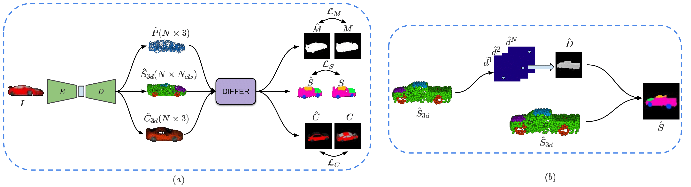

# DIFFER
Source codes for the paper [DIFFER: Moving Beyond 3D Reconstruction with Differentiable Feature Rendering].</br>
Accepted at *3D-WiDGET, First Workshop on Deep GEneraTive models for 3D understanding at CVPR" (CVPRW-19)*

## Overview
DIFFER proposes a differentiable rendering module to obtain feature projections like rgb image and part segmentations from point clouds. The work is an extension of <a href="https://github.com/val-iisc/capnet" target="_blank" >CAPNet</a>, which could obtain just mask projections from point clouds. The rendering module in differ is depth aware, and hence is able to effectively project features of point clouds on to the image plane. This allows us to train a point cloud reconstruction and feature prediction network in an end-to-end fashion with 2D supervision. <br>



## Dataset
We use the ShapeNet dataset in our experiments. For the part segmentation ground truth labels, we use the part annotated point clouds provided by <a href="https://cs.stanford.edu/~ericyi/project_page/part_annotation/" target="_blank" >Yi et al.</a>. Ground truth point clouds and training and validation splits are provided below: <br>
ShapeNet pointclouds (~2.8 GB): https://drive.google.com/open?id=1cfoe521iTgcB_7-g_98GYAqO553W8Y0g <br>
ShapeNet train/val split: https://drive.google.com/open?id=10FR-2Lbn55POB1y47MJ12euvobi6mgtc <br>
We use the <a href="https://github.com/shubhtuls/drc/blob/master/docs/snet.md#rendering" target="_blank" >code</a> provided by Tulsiani et al. to obtain the rendered images.   
Data download link for semantic part segmentation(rendered images + ground truth part annotated point clouds + dataset split) is provided below:<br>
Data (~300 MB): [https://drive.google.com/open?id=1IXpb2PT6Cw49N-VZ0whJsuLGRpJQ8wxO](https://drive.google.com/open?id=1IXpb2PT6Cw49N-VZ0whJsuLGRpJQ8wxO)

Download each of the folders, extract them and move them into *data/*. Save the rendered images and part segmentation maps in *data/ShapeNet_rendered/* and *data/partseg/ShapeNet_labels/* respectively <br> 
The folder structure should be as follows:<br>
--data/<br>
&nbsp; &nbsp; --ShapeNet_rendered/<br>
&nbsp; &nbsp; --ShapeNet_pcl/<br>
&nbsp; &nbsp; --splits/<br>
&nbsp; &nbsp; --partseg/<br>
&nbsp; &nbsp; &nbsp; &nbsp; --ShapeNet_rendered/<br>
&nbsp; &nbsp; &nbsp; &nbsp; --ShapeNet_labels/<br>
&nbsp; &nbsp; &nbsp; &nbsp; --ShapeNet_pcl/<br>
&nbsp; &nbsp; &nbsp; &nbsp; --splits/<br>

## Usage

Install [TensorFlow](https://www.tensorflow.org/install/). We recommend installing version 1.3 so that the additional TensorFlow ops can be compiled. <br>
Clone the repository:
```shell
git clone https://github.com/klnavaneet/differ.git
cd differ
```
### Training

#### Colored Point Cloud Reconstruction (RGB)
To train the model, run
```shell
cd rgb
bash run_train_rgb.sh
```
### Evaluation

#### Colored Point Cloud Reconstruction (RGB)

For visualization and metric calculation, run
```shell
cd rgb
bash run_metrics_rgb.sh
```
Make sure that the trained model exists before running the metric calculation code. Use the option *--visualize* in place of *--tqdm* to visualize the reconstructed 3D point clouds.

## TODO
1. Provide pre-trained models
2. Add code for part segmentation
3. Add dataset and codes for training and evaluation on Pix3D dataset
